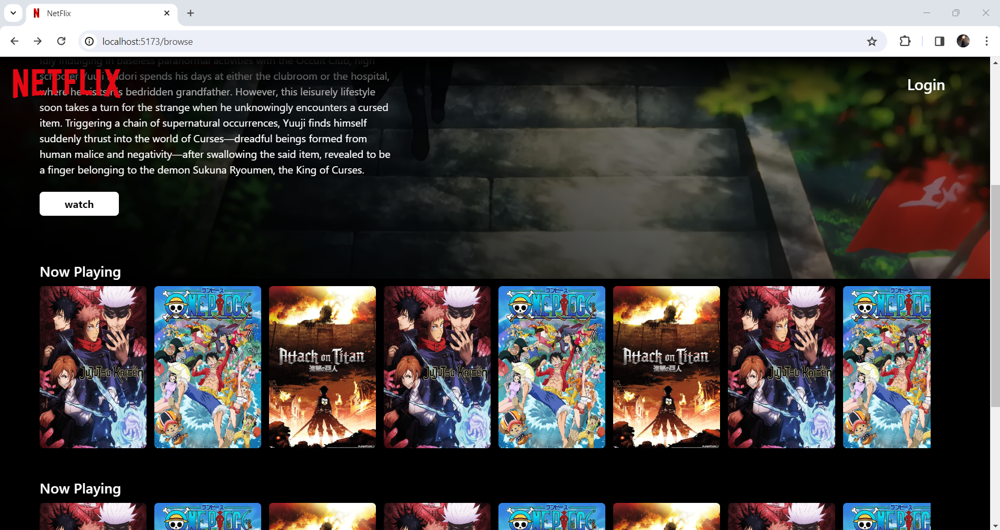
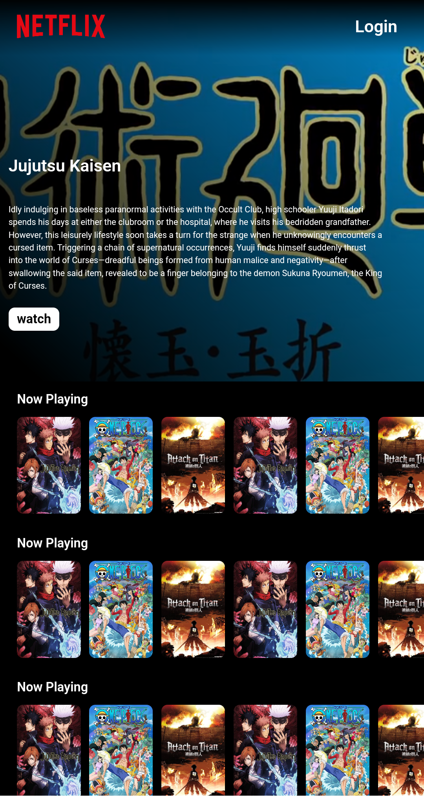
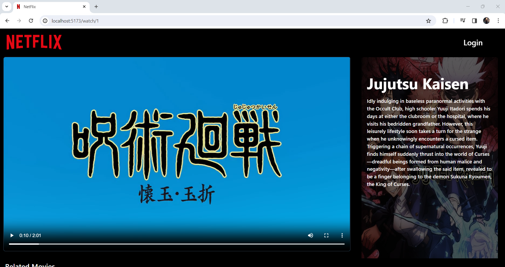
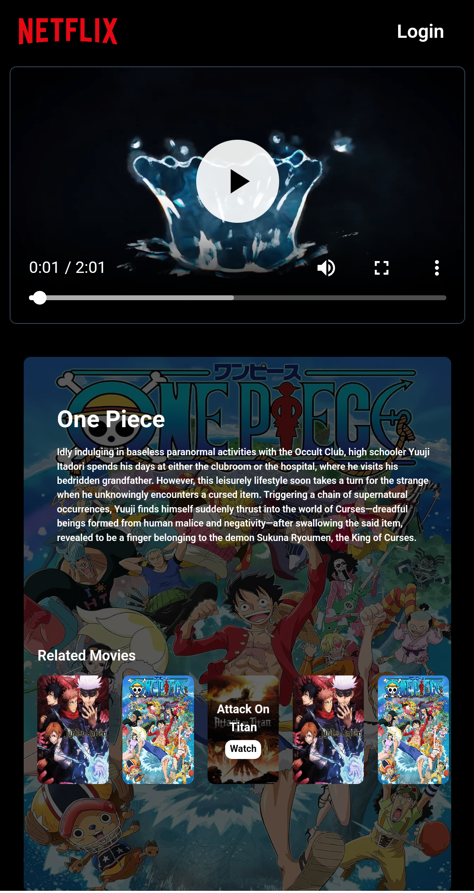
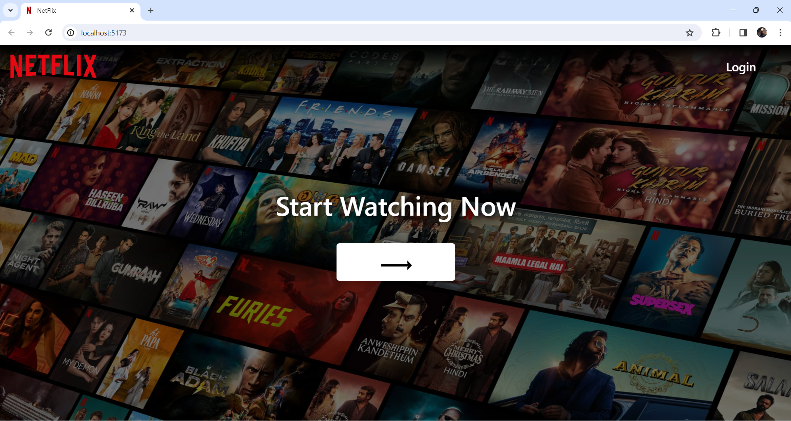
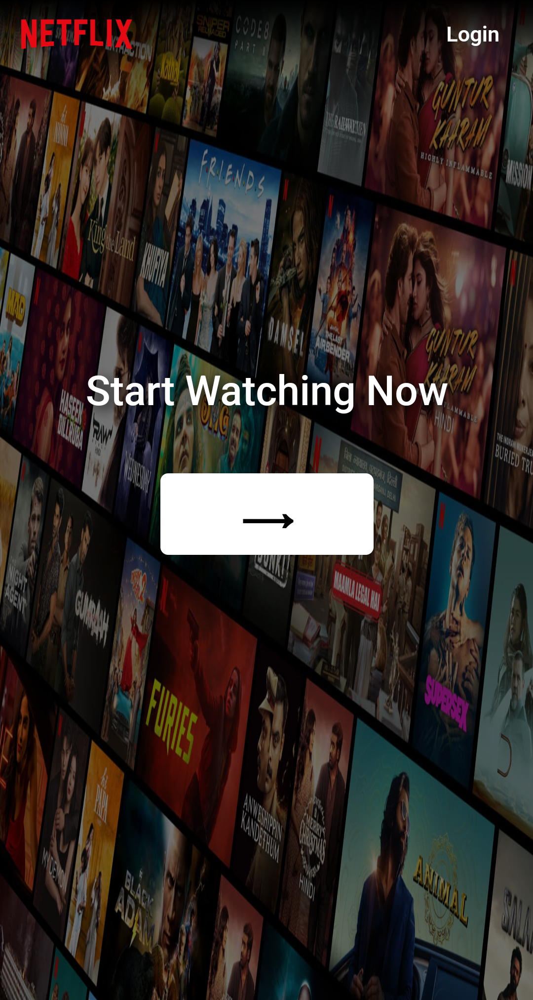
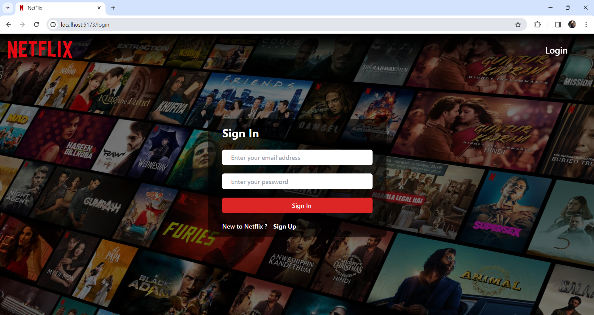
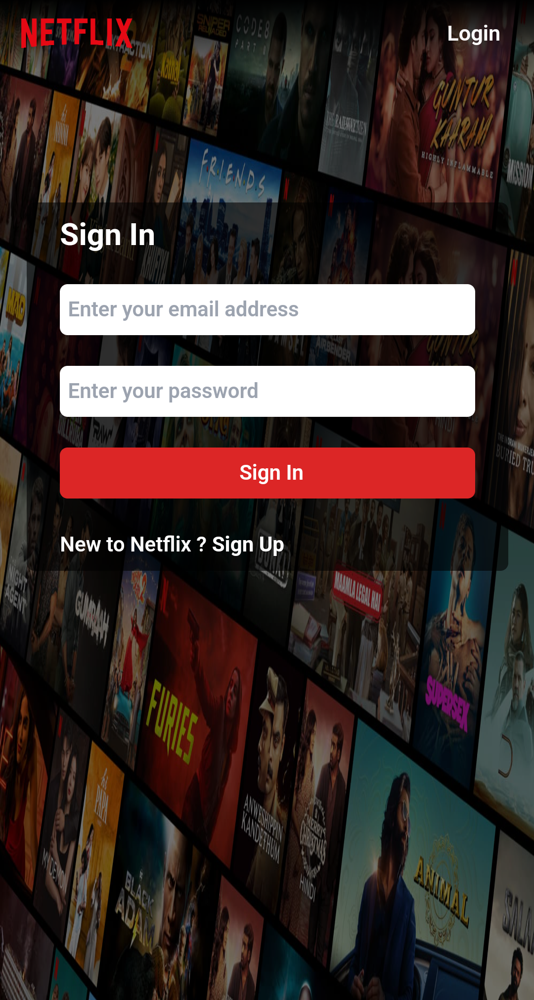
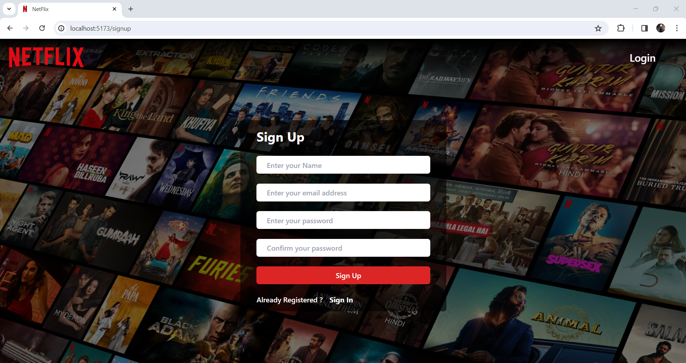
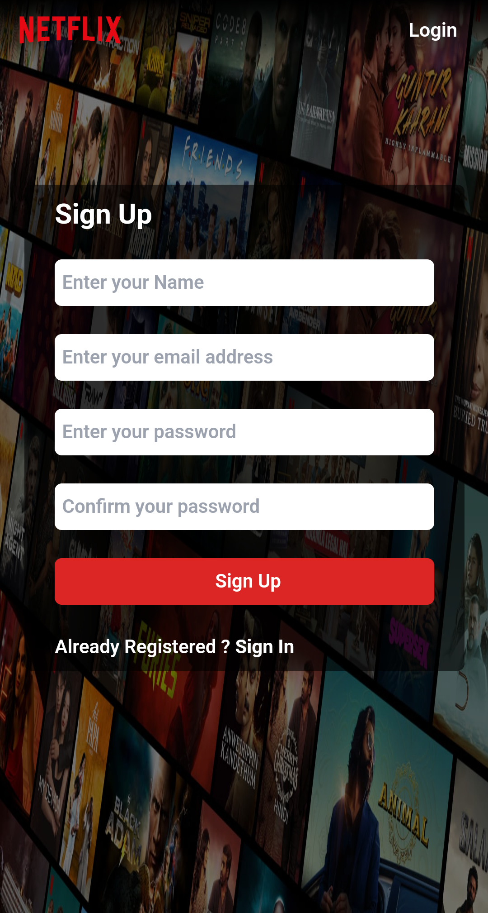

# Netflix Clone 

- In this project I tried to make clone of Netflix using **React JS**.
- I have styled the project using **tailwind css**.
- I made it **responsive** which can be viewed on different devices.
- Used **Redux Toolkit** for managing global states.

Thanks,

Here are some screenshots,

